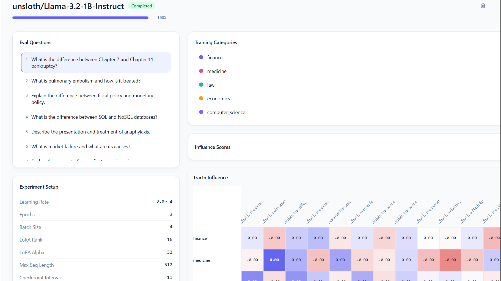

# Influence Proxy Dashboard

A full-stack research tool for AI safety researchers to fine-tune LLMs and compute per-training-example influence scores — turning fine-tuning from a black box into an auditable process.

Upload training QnA pairs and evaluation questions, provision a cloud GPU, and get back a ranked influence matrix showing exactly which training examples drove which model outputs. Built to help researchers empirically study LLM generalization.



---

## How It Works

Training data influence is computed using two complementary methods that run automatically on every job:

**TracIn (Online, During Training)**  
At regular checkpoint intervals during the LoRA fine-tuning loop, gradient dot products are computed between each training partition and each eval question:

```
TracIn(z_train, z_eval) = Σ_t η_t ( ∇L(w_t, z_train) · ∇L(w_t, z_eval) )
```

Only LoRA adapter gradients are tracked (not the frozen base model), reducing dimensionality from billions to ~2-4M parameters. Scores accumulate in CPU RAM — no checkpoints written to disk. By the time training finishes, the full TracIn matrix is complete.

**DataInf (Post-Training)**  
After training, DataInf approximates classical influence functions using a closed-form Sherman-Morrison expression over the final model's Fisher information:

```
I_DataInf(z_train, z_eval) = -Σ_l ∇θ_l ℓ(z_train)^T × (1/(nλ_l) × Σ_i U_{l,i}) × ∇θ_l ℓ(z_eval)
```

Training examples are processed one at a time to avoid OOM. No matrix inversion required. The result is a score matrix of the same shape as TracIn — one scalar per (train_partition, eval_question) pair.

Both matrices are written directly to Supabase Postgres by the GPU container when the job completes.

**Why both?** TracIn captures trajectory-based contribution (how much did this example reduce eval loss during training?). DataInf captures counterfactual influence (how much would the model change if this example were removed?). Showing both gives two complementary lenses on the same data.

---

## Architecture

```
Next.js Frontend
      │
      │  JWT-authenticated REST
      ▼
FastAPI (thin orchestrator)
      │
      ├── dispatches job via Modal spawn()
      │
      ▼
Modal Serverless A100
      │
      ├── downloads dataset from Supabase Storage
      ├── runs LoRA fine-tuning + online TracIn
      ├── runs post-hoc DataInf
      └── writes influence_scores directly to Supabase Postgres
                          │
                          └── Supabase Realtime pushes updates to frontend
```

FastAPI is a gateway only — it never passes large data payloads or performs ML computation. All influence scores flow Modal → Supabase directly.

**Key design decisions:**
- Online TracIn avoids checkpoint storage by accumulating scalar dot products in RAM
- Dataset upload goes directly to Supabase Storage via presigned URL — never through FastAPI
- Webhook callbacks from Modal to FastAPI are HMAC-signed for security
- Supabase RLS policies ensure users can only read their own jobs and scores

---

## Stack

| Layer | Technology |
|---|---|
| Frontend | Next.js 14+, TypeScript, Tailwind, shadcn/ui, Recharts |
| Backend | FastAPI (Python) |
| Database / Auth | Supabase (Postgres + Auth + Realtime + Storage) |
| GPU Compute | Modal (serverless A100s) |
| ML | PyTorch, HuggingFace Transformers, PEFT (LoRA/QLoRA) |
| Deployment | Vercel (frontend), Railway (FastAPI) |

---

## Quick Start

The dashboard is live at **[https://frontend-tau-seven-58.vercel.app/runs](https://frontend-tau-seven-58.vercel.app/runs)**.

1. **Create an account** — sign in with Google via the auth screen
2. **Upload your datasets** — navigate to Datasets and Evals to create or upload training QnA pairs and evaluation questions
3. **Launch a run** — configure your model, LoRA hyperparameters, and checkpoint interval, then submit
4. **Watch it train** — the Runs page streams live gradient norm and cosine similarity plots as training progresses on a cloud A100
5. **Analyze influence** — once complete, explore the influence score heatmap, ranked leaderboard, and per-category bar charts to see exactly which training examples drove your model's behavior on each eval question

For self-hosting or contributing to the codebase, open an issue or reach out directly.

---

## VRAM Requirements

The binding constraint is the online TracIn step, which holds base model, LoRA adapters, training activations, and eval gradients simultaneously.

| Setup | Minimum GPU |
|---|---|
| 7B model, LoRA rank ≤ 32, ≤ 100 eval questions | A100 40GB |
| 7B model with comfortable headroom | A100 80GB |
| 24GB GPUs (RTX 4090, L4) | ❌ Too tight |

DataInf post-training phase has significantly lower VRAM pressure since examples are processed one at a time.

---

## References

- TracIn: [Pruthi et al., 2020](https://arxiv.org/abs/2002.08484)
- DataInf: [Kwon et al., 2023 (ICLR 2024)](https://arxiv.org/abs/2310.00902) — reference implementation at [ykwon0407/DataInf](https://github.com/ykwon0407/DataInf)
- PEFT / LoRA: [Hu et al., 2021](https://arxiv.org/abs/2106.09685)

---

## License

MIT
